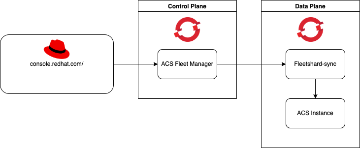
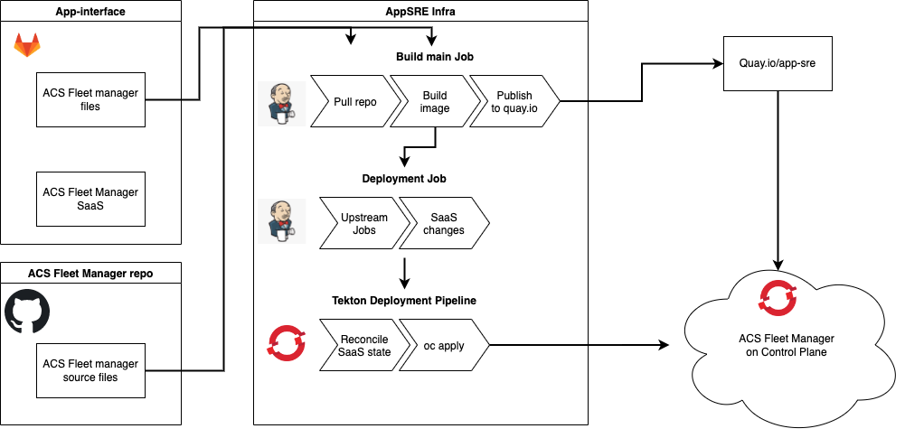

# ACS Fleet Manager

#### Table of Contents:
- [Overview](#overview)
- [Technology stack overview](#technology-stack-overview)
- [ACS Fleet Manager Interactions Overview](#acs-fleet-manager-interactions-overview)
- [Deployment flow](#deployment-flow)
- [SLO documents](#slo-documents)
- [Grafana dashboards](#grafana-dashboards)
- [Alerts](#alerts)
- [Metadata](#metadata)
- [Resource Capacity and Growth](#resource-capacity-and-growth)
- [Data Continuity and Disaster Recovery](#data-continuity-and-disaster-recovery)
- [Data Loss Impact](#data-loss-impact)
- [Runbook](#runbook)

### Overview

ACS Fleet Manager allows [Red Hat Cloud Console](https://console.redhat.com/) users to request and manage [ACS instance](https://github.com/stackrox/stackrox).

### Technology stack overview

- The service is written in [Golang](https://go.dev/)
- It uses [PostgreSQL](https://www.postgresql.org/) for persisting data
  - Both stage and production environments run on [AWS RDS](https://aws.amazon.com/rds/?trk=4bfa3aee-a8ec-4199-b4d6-a92630a09e06&sc_channel=ps&s_kwcid=AL!4422!3!548987291221!e!!g!!amazon%20relational%20database&ef_id=EAIaIQobChMIjYmG49rr-QIVzIxoCR1o2gJ7EAAYASABEgKoKfD_BwE:G:s&s_kwcid=AL!4422!3!548987291221!e!!g!!amazon%20relational%20database)
  - [Gorm](https://gorm.io/index.html) ORM is used and [Gormigrate](https://github.com/go-gormigrate/gormigrate) for migrations
- The service provides a REST API
  - The API is implemented according to the [OpenAPI specification](https://gitlab.cee.redhat.com/service/web-rca/-/blob/main/openapi/openapi.yaml)
  - List of [public APIs](https://github.com/stackrox/acs-fleet-manager/blob/main/openapi/fleet-manager.yaml)
  - List of [private APIs](https://github.com/stackrox/acs-fleet-manager/blob/main/openapi/fleet-manager-private.yaml)
  - List of [admin APIs](https://github.com/stackrox/acs-fleet-manager/blob/main/openapi/fleet-manager-private-admin.yaml)
- The service uses Red Hat SSO for [authentication](https://github.com/stackrox/acs-fleet-manager/blob/main/docs/auth/jwt-claims.md)
- The service metrics gathered by appSRE [Prometheus](https://prometheus.io/)

### ACS Fleet Manager Interactions Overview

See [miro ACSMS dashboard](https://miro.com/app/board/uXjVOh7XtrE=/)

### Deployment flow

Deployment steps:
1. AppSRE JenkinsCI runs [build main job](https://ci.ext.devshift.net/job/stackrox-acs-fleet-manager-gh-build-main/).
   - It includes building an image from source and pushing it to the quay.io under appSRE organisation.
2. AppSRE JenkinsCI triggers Tekton pipeline for selected target namespaces.
3. Tekton deploys the latest version to the control plane OSD cluster.

There are two triggers for the service deployment:
- New commit in the main branch in the GitHub ACS Fleet Manager repository.
- Any ACS Fleet Manager file is changed on [app-interface repository](https://gitlab.cee.redhat.com/service/app-interface).
  - The first deployment step is skipped if only ACS Fleet Manager [saas.yml](https://gitlab.cee.redhat.com/service/app-interface/-/blob/master/data/services/acs-fleet-manager/cicd/saas.yaml) is changed.
    It makes sense because saas.yml do not have any impact on image so there is no need to build a new one.

### SLO documents

See: Control Plane [SLO/SLI proposal document](https://docs.google.com/document/d/1P4zgZ1IYFD_wgYYfaT-AAQMe6afOVbt3YxORmNk7Bu4).

There is a list of SLO [documents](https://gitlab.cee.redhat.com/service/app-interface/-/tree/master/docs/acs-fleet-manager/slos).

### Grafana dashboards

There are two ACS grafana dashboard hosted on appSRE grafana instance:
- General service [overview dashboard](https://grafana.stage.devshift.net/d/D1C839d82/acs-fleet-manager?orgId=1).
- [SLO/SLI service dashboard](https://grafana.stage.devshift.net/d/T2kek3H9a/acs-fleet-manager-slos?orgId=1).

### Alerts

The service alerts are configured and located on the [app-interface repository](https://gitlab.cee.redhat.com/service/app-interface/-/blob/master/resources/observability/prometheusrules/acs-fleet-manager-stage.prometheusrules.yaml).

### Metadata

The service metadata overview can be found in two places:
- AppSRE app-interface repository contains [ACS Fleet Manager metadata](https://gitlab.cee.redhat.com/service/app-interface/-/blob/master/data/services/acs-fleet-manager/app.yml).
- Also, it is available on [visual app-interface service page](https://visual-app-interface.devshift.net/services#/services/acs-fleet-manager/app.yml).

### Resource Capacity and Growth

The dev team expects that ACS Fleet Manager CPU, memory, and disk usage will grow proportionally to the number of users 
for both OSD cluster and AWS RDS instance.
The number of running ACS Fleet Manager replicas can be configured via `REPLICAS` environment variable on [saas.yml](https://gitlab.cee.redhat.com/service/app-interface/-/blob/master/data/services/acs-fleet-manager/cicd/saas.yaml) file on app-interface.
The AWS RDS instance can be scaled with ACS Fleet Manager RDS resource configuration on app-interface
([prod](https://gitlab.cee.redhat.com/service/app-interface/-/blob/master/resources/terraform/resources/acs-fleet-manager/production/rds-pg14.yml)
and [stage](https://gitlab.cee.redhat.com/service/app-interface/-/blob/master/resources/terraform/resources/acs-fleet-manager/staging/rds-pg14.yml)).

There are factors which affect storage/database growth:
- ACS Fleet Manager retains information for each ACS instance for each user.
- ACS Fleet Manager retains information for each ongoing request for provisioning/deleting ACS instance.

There are factor which affect CPU and memory usage:
- ACS Fleet Manager receives users requests from https://console.redhat.com.
- ACS Fleet Manager leader replica has a reconciler loop which handles all ongoing provisioning/deleting requests.

### Data Continuity and Disaster Recovery

- AWS RDS:
  - ACS Fleet manager uses only AWS RDS (PostgreSQL) for persisting critical data. 
  - The AWS RDS instances is managed AppSRE team.
  - Both ACS Fleet Manager RDS resources are defined in app-interface repository ([prod](https://gitlab.cee.redhat.com/service/app-interface/-/blob/master/resources/terraform/resources/acs-fleet-manager/production/rds-pg14.yml) 
    and [stage](https://gitlab.cee.redhat.com/service/app-interface/-/blob/master/resources/terraform/resources/acs-fleet-manager/staging/rds-pg14.yml)).
  - In case of a database disaster, AppSRE would need to recreate that database and restore the latest backup.
    Also, it is possible to trigger restoring from the backup manually.
    Follow [appSRE instructions](https://gitlab.cee.redhat.com/service/app-interface#restoring-rds-databases-from-backups) for restoring RDS from the backup.
    Furthermore, ACS Fleet Manager deployments automatically check and apply schema migrations on startup. 
    So, if migrations were lost in the disaster, deployment will automatically update an out-of-date schema.
- Local filesystem:
  - Local filesystems on pods do not have any business-critical data.
    Thus, no action needed for recovering data from the pod filesystem.

In summary, ACS Fleet Manager AWS RDS is the only critical data store that may need to be recovered following a disaster.

### Data Loss Impact

If there is a disaster that results in the database losing any data. 
And lost data was recorded after last backup. 
In that case the only option is to manually restore it using ACS Fleet Manager logs.

Consequences of data loss may include but are not limited to:
- Provisioned ACS instance may disappear from users dashboard on https://console.redhat.com.
- Ongoing ACS instance provisioning request might be lost.
- Ongoing ACS instance deleting request might be lost.

ACS Fleet Manager does not retain or report any personally identifying information (PII) or critical financial records. 
Losing data in ACS Fleet Manager due to a disaster only noticeably affects the displayed users ACS instances on https://console.redhat.com. 
The ACS instances itself are hosted on separate cluster and should persist regardless ACS Fleet Manager AWS RDS lost data.
Requesting a new ACS Instance after data loss should not have any issue.

### Runbook

Follow ACS Fleet Manager [Standard operating procedure (SOP) on app-interface](https://gitlab.cee.redhat.com/service/app-interface/-/tree/master/docs/acs-fleet-manager/sop)
for detail instructions.
