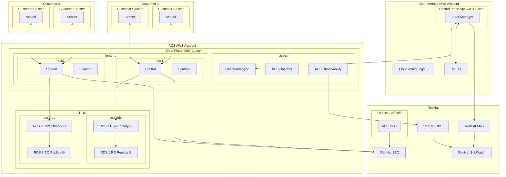

# ACSCS Architecture Diagram

```mermaid
graph
    direction LR

    subgraph rh[RedHat]
        subgraph RedHat Console
            ui(ACSCS UI)
        end
        sso[RedHat SSO]
        ams[RedHat AMS]
        subwatch[RedHat SubWatch]
        obs[RedHat OBS]

        ui --> sso
    end

    subgraph ai[App-Interface AWS Account]
        subgraph Control Plane AppSRE Cluster
            fm[Fleet-Manager]
        end
        cplogs["CloudWatch Logs 📜"]
        cprds["RDS ⛁"]

        fm <--> cprds
    end

    subgraph acsaws[ACS AWS Account]
        subgraph RDS
            subgraph acs1rds
                acs1rdsp["RDS 1 R/W Primary ⛁"]
                acs1rdss["RDS 1 RO Replica ⛁"]
                acs1rdsp-->acs1rdss
            end

            subgraph acs2rds
                acs2rdsp["RDS 2 R/W Primary ⛁"]
                acs2rdss["RDS 2 RO Replica ⛁"]
                acs2rdsp-->acs2rdss
            end
        end

        subgraph Data Plane OSD Cluster

            subgraph tenants
                subgraph acs1
                    acs1central[Central]
                    acs1scanner[Scanner]
                end
                subgraph acs2
                    acs2central[Central]
                    acs2scanner[Scanner]
                end
            end
            subgraph acscs
                fs[Fleetshard-Sync]
                acsop[ACS Operator]
                acsobs[ACS Observability]
            end

            fm<-->fs
            acs1central-->sso
            acs1central-->acs1rdsp
            acs2central-->sso
            acs2central-->acs2rdsp
        end
    end

    fm-->ams
    ams-->subwatch
    obs-->subwatch
    acsobs-->obs

    subgraph c1[Customer 1]
        subgraph Customer Cluster
            c1s1[Sensor]
        end
        subgraph Customer Cluster
            c1s2[Sensor]
        end
    end
    c1s1 <--> acs1central
    c1s2 <--> acs1central

    subgraph c2[Customer 2]
        subgraph Customer Cluster
            c2s1[Sensor]
        end
        subgraph Customer Cluster
            c2s2[Sensor]
        end
    end

    c2s1 <--> acs2central
    c2s2 <--> acs2central
```
