# ACSCS Architecture Diagram

```mermaid
graph
    direction LR

    subgraph rh[RedHat]
        subgraph RedHat Console
            ui(ACSCS UI)
        end
        sso[RedHat SSO]
        ams[RedHat AMS]
        subwatch[RedHat SubWatch]
        obs[RedHat OBS]

        ui --> sso
    end

    subgraph ai[App-Interface AWS Account]
        subgraph Control Plane AppSRE Cluster
            fm[Fleet-Manager]
        end
        cplogs["CloudWatch Logs 📜"]
        cprds["RDS ⛁"]

        fm <--> cprds
    end

    subgraph acsaws[ACS AWS Account]
        subgraph Data Plane
            fs[Fleetshard-Sync]
            acsop[ACS Operator]
            acsobs[ACS Observability]
            acs1[ACS instance 1]
            acs2[ACS instance 2]

            fm<-->fs
            acs1<-.->sso
            acs2<-.->sso
        end
    end

    fm-->ams
    ams-->subwatch
    obs-->subwatch
    acsobs-->obs

    subgraph Customer Domain
        subgraph Customer 1
            subgraph Customer Cluster
                c1s1[Sensor]
            end
            subgraph Customer Cluster
                c1s2[Sensor]
            end
        end
        c1s1 <--> acs1
        c1s2 <--> acs1

        subgraph Customer 2
            subgraph Customer Cluster
                c2s1[Sensor]
            end
            subgraph Customer Cluster
                c2s2[Sensor]
            end
        end
        c2s1 <--> acs2
        c2s2 <--> acs2
    end
    
```



<!-- ```mermaid
%% https://quay.io/repository/rhacs-eng/stackrox-operator-index?tab=tags
%%{init: { 'gitGraph': {'showBranches': true, 'mainBranchName': 'master' }}}%%
gitGraph
    commit id: "v3.72.0-527-abcdefghijk"
    commit id: "v3.72.0-528-abcdefghijk"
    commit id: "v3.72.0-530-abcdefghijk"

    branch nightly_quay
    cherry-pick id:"v3.72.0-527-abcdefghijk"
    cherry-pick id:"v3.72.0-528-abcdefghijk"
    cherry-pick id:"v3.72.0-530-abcdefghijk" 

    checkout master
    branch release
    commit id: "test"
``` -->