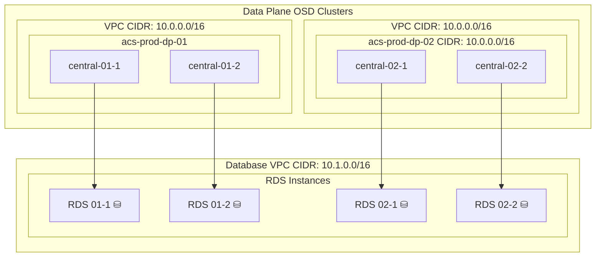

# ACSCS Network (VPC) Diagram

- Diagram represents one environment (e.g. Stage, Prod)
- OSD Clusters have their own VPC provisioned at creation time
  - We leave their CIDR range as the default (10.0.0.0/16)
  - This means that they *can not* be networked together

