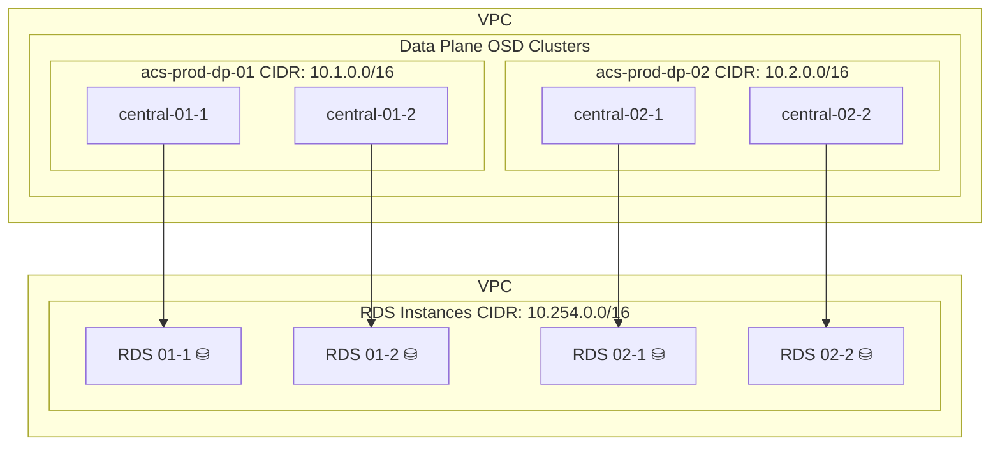

# ACSCS Network (VPC) Diagram

- Diagram is within the environment's single AWS Account

## One VPC for all data plane clusters, one VPC for all RDS instances:

```mermaid
graph
    direction LR

    subgraph vpcdps[VPC]
        subgraph dps[Data Plane OSD Clusters]
            subgraph dp1[acs-prod-dp-01 CIDR: 10.1.0.0/16]
                central-01-1
                central-01-2
            end
            subgraph dp2[acs-prod-dp-02 CIDR: 10.2.0.0/16]
                central-02-1
                central-02-2
            end
        end
    end

    subgraph vpcrds[VPC]
        subgraph rds[RDS Instances CIDR: 10.254.0.0/16]
            rds-01-1["RDS 01-1 ⛁"]
            rds-01-2["RDS 01-2 ⛁"]
            rds-02-1["RDS 02-1 ⛁"]
            rds-02-2["RDS 02-2 ⛁"]
        end
    end

    central-01-1 --> rds-01-1
    central-01-2 --> rds-01-2
    central-02-1 --> rds-02-1
    central-02-2 --> rds-02-2

    
```
