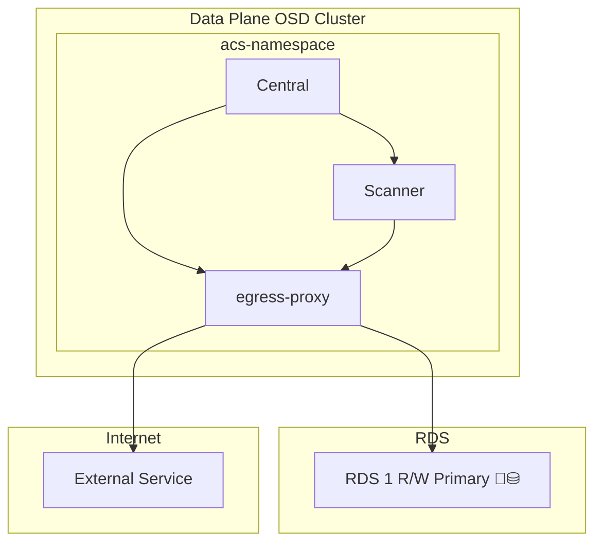

```mermaid

graph
    direction LR
    subgraph RDS
            acs1rdsp["RDS 1 R/W Primary 🐘⛁"]
    end

    subgraph Data Plane OSD Cluster
        subgraph acs-namespace
            acs1central[Central]
            acs1egress[egress-proxy]
            acs1scanner[Scanner]
        end

        acs1central-->acs1scanner
        acs1central-->acs1egress
        acs1scanner-->acs1egress
        acs1egress-->acs1rdsp
    end

    subgraph Internet
        c1s1[External Service]
    end

    acs1egress-->c1s1
```
