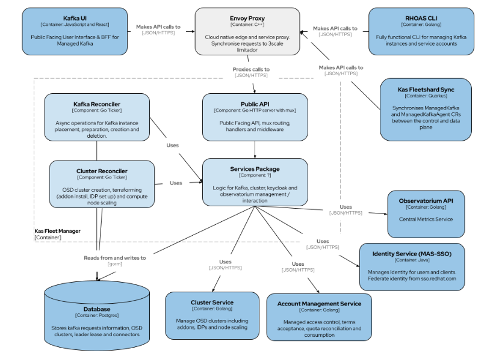

# Implementation

This document is intended to be an overview of the implementation details of the service.

The system is comprised of three main components, each implemented using the layered architecture:

- REST API
- Central Worker
- Cluster Worker



## REST API

The system has a REST API for managing Central resources. This is the primary interface used by
end-users to communicate with the service.
From a high level the API is a layered architecture service, divided into the following layers
```
api-routes -> http middleware -> handler -> business logic -> database / external API calls.
```
1. `api-routes` layer is responsible for wiring the routes that are to be exposed.
2. `http middleware layer` is where all the pre-flight checks like terms acceptance are performed
3. `handler layer` is responsible for the wiring of the incoming http request to the appropriate business logic.
   It's also in this layer where validation are performed. All the conversion and and presention from/to the DTO are done in this layer too.
4. `business logic` layer or also known as the application service layer is where all the business specific logic resides.
5. `database` layer is the final layer where database specific knowledges resides. We can also perform external API calls e.g SSO API calls, DNS system calls  

>NOTE: The inner layers shouldn't know any details about the outer layer. e.g the business logic layer should call methods in the http middleware layer.

The Rest endpoints are of three categories.
- [Public user facing API](../openapi/fleet-manager.yaml)
- [The admin endpoints](../openapi/fleet-manager-private-admin.yaml) to perform some admin tasks like upgrades. The endpoint is not visible to the normal user and it requires special permissions to be accessed
- [The fleetshard synchronisation endpoints](../openapi/fleet-manager-private.yaml) for communication between the fleetshard operator and the fleet manager. The endpoint is not visible to the user and it requires a special _service account_ in sso to be accessed.

They are all setup in the [route_loder.go](../internal/central/pkg/routes/route_loader.go) file.

The OpenAPI spec for this API can be seen by running:

```
make run/docs
```

This will serve the OpenAPI spec on `localhost:8082`

See the [customizing OpenAPI Spec](./customizing-openapi-spec.md) for more info on customizing OpenAPI spec.

It's important to note that the system is asynchronous, meaning that once a Central resource is
created via the REST API, there won't be a running Central instance created by the time the HTTP
response is sent by the service. A client will need to continue watching or polling their Central
resource to determine whether it has a `ready` status or not.

The REST API requires a valid `Authorization` OCM Bearer token header to be provided with all
requests, to obtain a short-lived token run:

```
ocm token
```

See [adding a new endpoint](./adding-a-new-endpoint.md) documentation for more info on how the http endpoints are structured.

## Central Workers

The Central Workers are responsible for reconciling Centrals as requested by an end-user.
There are currently 7 central workers, which are located in the [centrals_mgrs folder](../internal/central/pkg/workers/centrals_mgrs):
- [`centrals_mgr.go`](../internal/central/pkg/workers/centrals_mgrs/centrals_mgr.go) responsible for reconciling central metrics and performing cleanup of trial centrals, and cleanup of centrals of denied owners.
- [`deleting_centrals_mgr.go`](../internal/central/pkg/workers/centrals_mgrs/deleting_centrals_mgr.go) responsible for handling the deletion of centrals e.g removing resources like AWS Route53 entry, IAM secrets client
- [`accepted_centrals_mgr.go`](../internal/central/pkg/workers/centrals_mgrs/accepted_centrals_mgr.go) responsible for checking if user is within Quota before provisioning a central. Afterwards, it will periodically reconcile on all pending Central resources, attempt to find a valid OpenShift cluster to fit it's requirements (cloud provider, region, etc.) and provision a Central instance to the cluster. Once a suitable Dataplane cluster has been found, we'll update the status of the Central resource to reflect it's current progress.
- [`preparing_centrals_mgr.go`](../internal/central/pkg/workers/centrals_mgrs/preparing_centrals_mgr.go) responsible for creating external resources e.g AWS Route53 DNS, IAM authentication secrets
- [`provisioning_centrals_mgr.go`](../internal/central/pkg/workers/centrals_mgrs/provisioning_centrals_mgr.go) responsible for checking if a provisioned central is ready as reported by the fleetshard-operator
- [`ready_centrals_mgr.go`](../internal/central/pkg/workers/centrals_mgrs/ready_centrals_mgr.go) responsible for reconciling external resources of a ready centrals
- [`centrals_routes_cname_mgr.go`](../internal/central/pkg/workers/centrals_mgrs/centrals_routes_cname_mgr.go) responsible for reconciliation of DNS records for each centrals' routes.

Once the Central Workers have set up a Central resource, the status of the Central request will be `ready`.
If provisioning of a central fails, the status will be `failed` and a failed reason will be capture in the database.
A deleted central has a final state of `deleting`, and it will appear in the database as a soft deleted record with a `deleted_at` timestamp different from `NULL`.

The end-user has no way to directly interact with the Central worker, management of Central resources should be handled through the REST API.

## Cluster Worker

The Cluster Worker is responsible for reconciling OpenShift clusters and ensuring they are in a
state capable of hosting Central instances, this process is referred to as terraforming in this
service. The reconciler is located on [`cluster_mgr.go`](../internal/central/pkg/workers/clusters_mgr.go)

Once a cluster has been provisioned and terraformed, it is considered capable of hosting Central
resources as it's status will be marked as `ready`. This cluster will then be visible to the Central
Worker when it is searching for clusters.

The end-user has no way to directly interact with the Cluster Worker.

> NOTE: The workers can be modified to accomodate for your own business logic.
