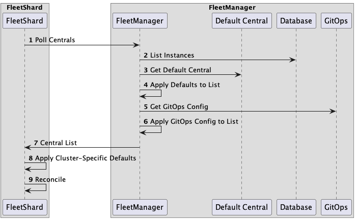

# GitOps Workflow

1. `fleetshard` polls `fleetmanager` for a list of `Centrals` by sending an api request
2. `fleetmanager` lists the central instances from the database
3. `fleetmanager` applies the default configuration to the central instances
4. `fleetmanager` retrieves the gitops configuration
5. `fleetmanager` applies the gitops configuration to the central instances
6. `fleetmanager` returns the list of central instances to `fleetshard`
7. `fleetshard` applies the cluster-specific configuration/overrides to the central instances
8. `fleetshard` performs reconciliation of the central instances

The `gitops` configuration repository is located at https://gitlab.cee.redhat.com/stackrox/acs-cloud-service/config
